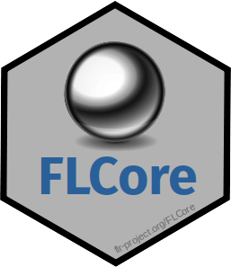

# FLCore 

[](https://github.com/flr/FLCore/actions)
[](https://www.gnu.org/licenses/gpl-2.0.html)

## Overview
FLCore contains the core classes and methods for FLR, a framework for fisheries modelling and management strategy simulation in R.

## Installation
To install this package, start R and enter:

	install.packages("FLCore", repos="http://flr-project.org/R")

or directly from the github repository by using:

```
  remotes::install_github("flr/FLCore")
```

## Documentation
- [Help pages](http://flr-project.org/FLCore)

## Citation
Kell, L. T., I. Mosqueira, P. Grosjean, J-M. Fromentin, D. Garcia, R. Hillary, E. Jardim, S. Mardle, M. A. Pastoors, J. J. Poos, F. Scott, R. D. Scott. 2007. FLR: an open-source framework for the evaluation and development of management strategies. *ICES J Mar Sci*, 64 (4): 640-646. doi: [10.1093/icesjms/fsm012](https://doi.org/10.1093/icesjms/fsm012)

## License
Copyright (c) 2004-2021 The FLR Team. Released under the [GPL v2](http://www.gnu.org/licenses/gpl-2.0.html).

## Contact
You are welcome to:

- Submit suggestions and bug-reports at: <https://github.com/flr/FLCore/issues>
- Send a pull request on: <https://github.com/flr/FLCore/>
- Compose a friendly e-mail to: <flrteam@flr-project.org>
- Author: FLR Team and various [contributors](CONTRIBUTORS.md).
- Maintainer: Iago Mosqueira (WMR) <iago.mosqueira@wur.nl>
